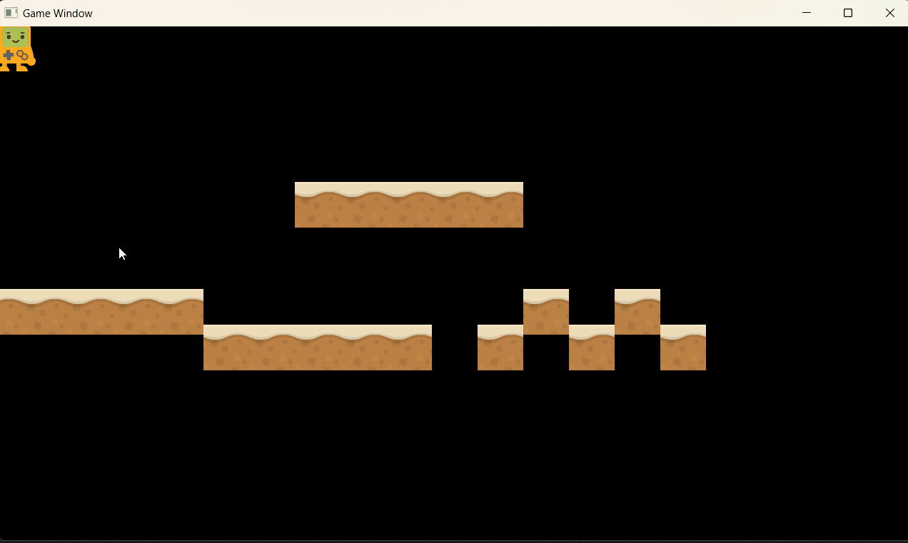
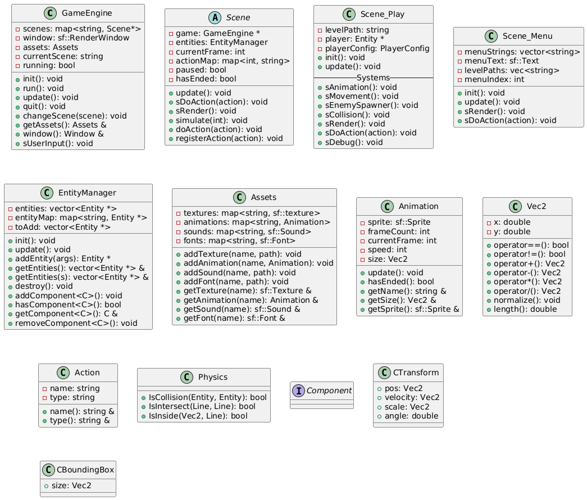

# SFMLGameEngine

A modular and lightweight 2D game engine built using C++ and SFML.  
This engine provides a solid foundation for developing 2D games, featuring an entity-component system, asset management, animation handling, and basic physics integration.
NOTE : The engine is work in progress - code structure and architecture is bound to evolve over time.

## DEMO 

## Features

- **Entity-Component System (ECS):** Flexible architecture allowing dynamic composition of game entities.
- **Asset Management:** Efficient loading and management of textures, fonts, and other resources.
- **Animation System:** Support for sprite animations with customizable frame sequences.
- **Physics Integration:** Basic physics components for movement and collision detection.
- **Modular Design:** Clean separation of concerns, making it easy to extend and maintain.

## Engine Architecture

